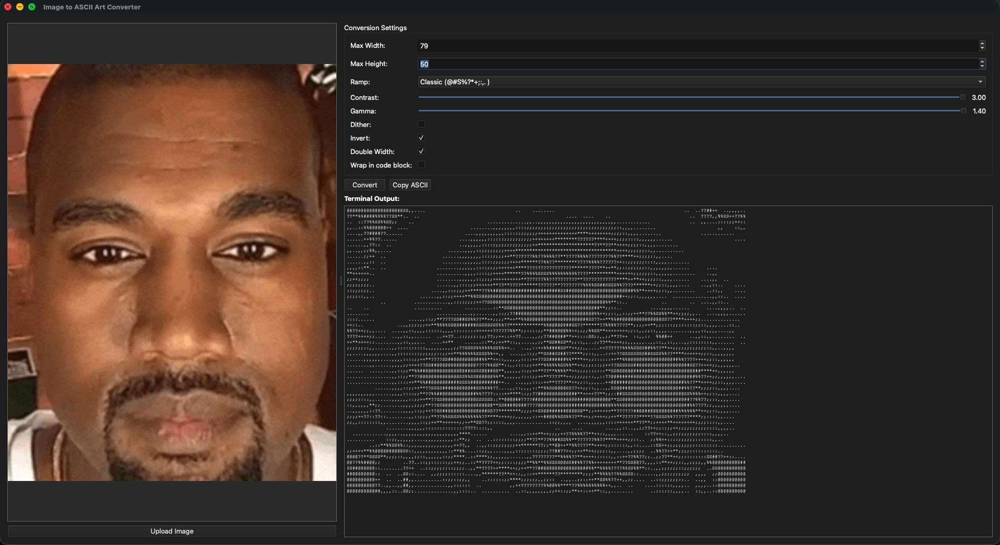

# Art, Squinting Can Improve It (ASCII)

Convert images into ASCII art, three ways: a **web app** (deployed on Vercel),
a **desktop GUI** (PySide6 with a Tkinter fallback), and a **command-line tool**
for batch processing. All share the same ramp/contrast/gamma/dithering pipeline.


## Web version

The browser app is a static `index.html` frontend backed by a Python
serverless function (`api/convert.py`) that does the conversion with Pillow.
It's configured for [Vercel](https://vercel.com/) via `vercel.json`:

```bash
npm i -g vercel   # if needed
vercel dev        # run the static page + /api/convert locally
vercel            # deploy
```

The serverless function only needs Pillow (`requirements.txt`); the desktop
app's Qt dependency is kept separate in `requirements-desktop.txt`.

## Features

- 🖼️ **Image Preview**: Upload and preview images with automatic scaling
- 🎨 **Multiple ASCII Ramps**: Choose from Blocks, Classic, or Detailed character sets
- ⚙️ **Advanced Controls**:
  - Adjustable max width/height
  - Contrast and gamma correction
  - Optional dithering for smoother gradients
  - Invert colors
  - Double-width characters for better readability
- 📋 **Clipboard Integration**: Copy ASCII art with optional code block wrapping for chat apps
- 🖥️ **Terminal-Style Output**: Dark-themed monospace display that looks like a real terminal
- 🔄 **Real-Time Conversion**: Auto-updates as you adjust settings
- 🎯 **Two GUI Options**: PySide6 (Qt) with Tkinter fallback

## Screenshots



*Upload an image, adjust settings, and watch your ASCII art come to life!*

## Installation

### Prerequisites

- Python 3.8 or higher
- pip (Python package manager)

### Steps

1. **Clone the repository:**
   ```bash
   git clone <repository-url>
   cd img_2_ascii
   ```

2. **Create a virtual environment (recommended):**
   ```bash
   python3 -m venv venv
   
   # On macOS/Linux:
   source venv/bin/activate
   
   # On Windows:
   venv\Scripts\activate
   ```

3. **Install dependencies:**
   ```bash
   # Desktop GUI (PySide6 + Pillow)
   pip install -r requirements-desktop.txt

   # CLI / web API only (just Pillow)
   pip install -r requirements.txt
   ```

## Usage

### Running the GUI Application

Simply run:
```bash
python img2ascii_gui.py
```

The application will automatically try to use PySide6 (Qt). If PySide6 is not available, it will fall back to Tkinter.

### Command-Line Interface

The project also includes a command-line version for batch processing:

```bash
python img2ascii.py path/to/image.jpg
```

**CLI Options:**
- `--max-width WIDTH` - Maximum width in characters (default: 80)
- `--max-height HEIGHT` - Maximum height in characters (default: 40)
- `--contrast VALUE` - Contrast enhancement (default: 1.4)
- `--gamma VALUE` - Gamma correction (default: 0.8)
- `--dither` - Enable dithering
- `--invert` - Invert colors
- `--double` - Double characters horizontally
- `--chat` - Wrap output in code block and use chat-friendly ramp
- `--chat-ramp {blocks,classic}` - Choose chat ramp style

**Example:**
```bash
python img2ascii.py image.jpg --max-width 100 --contrast 1.8 --chat --chat-ramp blocks
```

## GUI Controls

### Image Settings
- **Max Width**: Maximum number of characters per line (default: 70)
- **Max Height**: Maximum number of lines (default: 35)

### Ramp Selection
- **Blocks**: `█▓▒░ ` - Bold, high-contrast characters (great for chat)
- **Classic**: `@#S%?*+;:,. ` - Traditional ASCII art style
- **Detailed**: Long gradient ramp for fine detail

### Image Processing
- **Contrast**: Adjust contrast (1.0-3.0, default: 1.6)
- **Gamma**: Gamma correction (0.4-1.4, default: 0.75)
- **Dither**: Enable Floyd-Steinberg dithering for smoother gradients
- **Invert**: Invert the image colors
- **Double Width**: Repeat each character horizontally (better for some fonts)

### Output Options
- **Wrap in code block**: When copying, wrap the ASCII art in \`\`\`txt code blocks (useful for Discord, Slack, etc.)

## How It Works

1. **Image Loading**: The app accepts common image formats (PNG, JPG, GIF, BMP, WebP)
2. **Preprocessing**: 
   - Converts to grayscale
   - Applies autocontrast
   - Enhances contrast
   - Applies gamma correction
3. **Resizing**: Intelligently resizes to fit within max width/height while preserving aspect ratio
4. **Dithering** (optional): Applies Floyd-Steinberg dithering for smoother gradients
5. **Character Mapping**: Maps pixel brightness to characters from the selected ramp
6. **Output**: Displays in terminal-style text area and allows copying to clipboard

## Project Structure

```
img_2_ascii/
├── img2ascii.py              # Core ASCII conversion logic (CLI)
├── img2ascii_gui.py          # GUI launcher (PySide6, Tkinter fallback)
├── img2ascii_gui_tk.py       # Tkinter GUI implementation
├── index.html                # Web frontend (static)
├── api/
│   └── convert.py            # Vercel serverless conversion endpoint
├── vercel.json               # Vercel build + routing config
├── requirements.txt          # Web/CLI deps (Pillow)
├── requirements-desktop.txt  # Desktop deps (PySide6 + Pillow)
├── example.jpg               # Sample image (README screenshot)
├── LICENSE
└── README.md                 # This file
```

## Dependencies

- **Pillow** (>=10.0.0): image processing — used by the CLI, GUI, and web API
- **PySide6** (>=6.5.0): Qt GUI framework for the desktop app

If PySide6 isn't installed, the desktop app falls back to Tkinter (bundled
with Python). The web API needs only Pillow.

## Contributing

Contributions are welcome! Feel free to:
- Report bugs
- Suggest new features
- Submit pull requests
- Improve documentation

## License

MIT License - feel free to use this project for any purpose.

## Acknowledgments

Inspired by the classic art of ASCII conversion, with a modern twist for the digital age.

---

**Art, Squinting Can Improve It (ASCII)** - Because sometimes the best way to see art is through characters.
